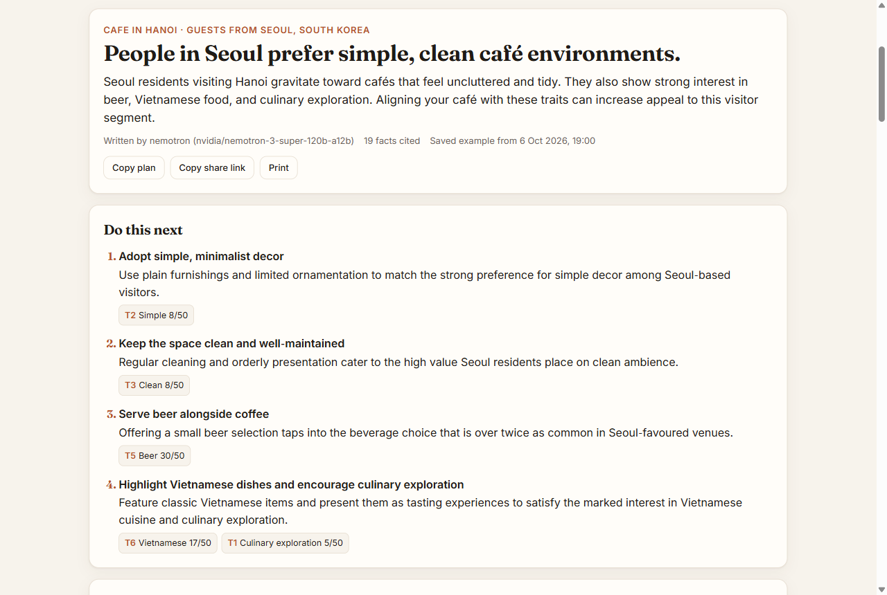
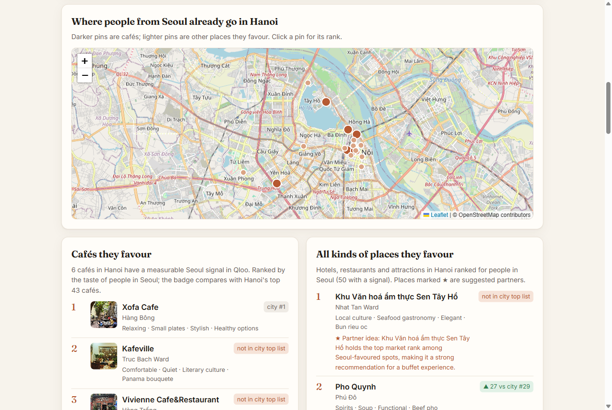
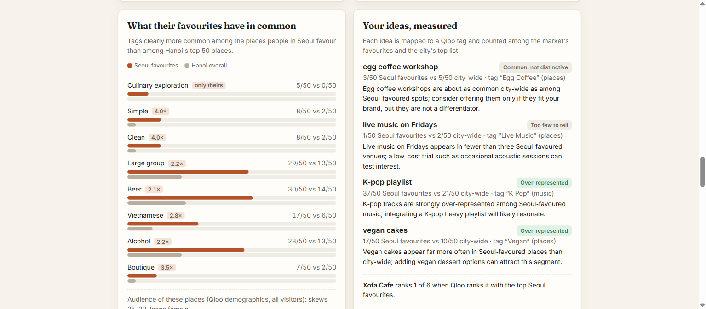

# Taste Brief

**A taste brief for small hospitality businesses in Vietnam.** A café, homestay or tour owner picks the visitors they want — people from Seoul, Tokyo, Sydney — and gets a one-page plan grounded in Qloo's taste graph:
- where those visitors already go in the city;
- what those places have in common;
- music both visitors and locals know;
- how the owner's own ideas measure up.

Every claim on the page links to the Qloo result behind it. The page and the plan are available in English and Vietnamese.

**Live:** https://taste-brief.vercel.app (open an example from the top of the page; it needs no waiting)

Built for the [Qloo Agentic Hackathon](https://qloo.devpost.com):
- **Data:** Qloo Taste AI™ (hackathon API).
- **Agent:** NVIDIA Nemotron 3 Super on Nebius Token Factory.
- **MCP:** the same tools are served at `/mcp`.



## The problem

Vietnam's small cafés, homestays and tour operators depend on foreign visitors, and most of them market to "tourists" in general. An owner who wants more guests from Seoul has two sources today:
- a guess;
- a chatbot that answers from general knowledge.

Both tend to name the same famous places and the same global stars.

A general chatbot cannot answer the sharper question: which places in Hanoi do people from Seoul favour **more than** Hanoi does overall, and what do those places have in common? Qloo can, because its taste graph links places, music and TV to the aggregate taste of people in a given city.

## What it does

Pick a business type, a Vietnamese city and a visitor market (a city such as Seoul, Tokyo, Sydney or Singapore).

| Section | How it is computed |
|---|---|
| **Places of your kind they favour** | Qloo ranks places of the owner's kind in the city by the taste of people in the visitor city. Each place carries a badge with its rank in the same list without that signal. Peers are confirmed by Qloo's primary genre, so a pho shop does not count as a café. |
| **All kinds of places they favour, on a map** | The same comparison across every kind of place: hotels, restaurants, attractions. The model marks some of them as partner ideas. |
| **What their favourites have in common** | Tags (ambience, setting, offerings, cuisine) that are clearly more common among the market's favourite places than among the city's top 50. A tag must be at least 1.5× as common and 10 points higher; tags nearly every place carries are dropped. Tags are ranked by smoothed log-odds. |
| **Audience** | Qloo demographics for the top favourites: which age band and gender over-index. |
| **Your ideas, measured** | A Nemotron tool loop maps each idea to a Qloo tag and scores it against the same lists. Music ideas are scored against artists, place ideas against places. Possible verdicts: over-represented, common, less common, absent from their favourites, too few to tell, untested. |
| **Your own place** | Found in Qloo and ranked against the market's favourites, with ties. |
| **Music both sides know** | Artists loved by people in the visitor city that people in the host city also love, plus artists distinctive to the visitors. The same is done for TV. |
| **Same question, no Qloo** | The same model answers with no data. Each place it names is then looked up in Qloo and ranked with the market signal. |

### Example: Hanoi café, guests from Seoul

The numbers below come from `data/samples/hanoi-cafe-seoul.json`.

- **Cafés:** Qloo measures a Seoul signal for 6 Hanoi cafés; Xofa Cafe ranks first. Across all kinds of places, the Sen Tây Hồ food hall ranks first for people in Seoul, yet it is not in Hanoi's overall top 50.
- **Shared traits:** places people in Seoul favour are much more often tagged *Simple* (8/50 against 2/50 city-wide) and *Large group* (29/50 against 13/50).
- **Owner ideas:**
  - "K-pop playlist" is over-represented: the K-Pop tag is on 37 of the 50 artists people in Seoul favour, against 21 of Hanoi's 50.
  - "Egg coffee workshop" is common rather than distinctive (3/50 against 5/50).
- **The model without data:** it names The Note Coffee, Cong Caphe and Hanoi Social Club. Qloo knows all three, but none has a measurable Seoul signal.



## Qloo workflows used, and why

| Need | Qloo request | Why it fits |
|---|---|---|
| Market favourites vs the city | `/v2/insights` `filter.type=urn:entity:place`, `filter.location.query=<city>`, `filter.tags=<business genres>` (and without), with and without `signal.location.query=<market>` | The location signal is what turns "tourists" into a specific audience; comparing with the unsignalled list shows what that audience adds. |
| Shared culture | `/v2/insights` `filter.type=urn:entity:artist` / `urn:entity:tv_show`, `signal.location.query=<market>` and `=<city>` | Overlap gives a playlist both guests and locals know. |
| Mapping an idea | `/v2/tags` `filter.query=<keyword>` | Lets the agent choose a real Qloo tag; it may only score tag ids Qloo returned. |
| Ranking named things | `/v2/insights` `filter.results.entities=<ids>` with the market signal | Ranks the owner's place and the model's picks fairly. |
| Finding a place | `/search` `query=<name> <city>`, `types=urn:entity:place` | Resolves the owner's place and the model's picks. |
| Audience | `/v2/insights` `filter.type=urn:demographics`, `signal.interests.entities=<top favourites>` | Age and gender skew of the favourites' audiences. |

### One request and its result

The request below returns Hanoi cafés ranked for people in Seoul. The key goes in the `X-Api-Key` header on the server and is never sent to the browser.

```
GET /v2/insights?filter.type=urn:entity:place
  &filter.location.query=Hanoi
  &filter.tags=urn:tag:genre:place:restaurant:coffee_shop,urn:tag:genre:place:cafe,urn:tag:category:place:coffee_shop
  &operator.filter.tags=union
  &signal.location.query=Seoul
  &take=50
```

The first result, reduced to what the app keeps:

```json
{ "name": "Xofa Cafe", "genre": "restaurant:coffee_shop", "affinity": 0.9917,
  "rank": 1, "cityRank": 1,
  "tags": ["Relaxing", "Small plates", "Stylish", "Healthy options"] }
```

It becomes ledger entry `P1`. Any action that cites `P1` shows this place, its ranks and the request above when clicked.

## The evidence rule

Every Qloo result that can support a recommendation goes into a ledger with a short reference (`P3` place, `T1` tag, `C2` culture, `I1` idea) and the request that produced it. The model writes the brief from a fact sheet built from the ledger. The server then removes three kinds of action:
- actions that cite no valid reference;
- actions that recommend adding an idea whose verdict is not "over-represented";
- actions that name places or landmarks that are not in the data.

The page lists what was removed and why. Names, ranks and counts on the page come from the ledger, not from model text. Without a model key, the brief is assembled by rule from the same ledger.



## Architecture

```
browser ──POST /api/brief (server-sent events)──▶ Express
                                                   │
                         ┌─────────────────────────┼──────────────────────────┐
                         ▼                         ▼                          ▼
              Qloo /v2/insights, /search,    Nemotron tool loop        Nemotron JSON brief
              /v2/tags (server-side key,     (find tags, score ideas)  + LLM-only picks
              paced, cached 12 h)                  │                    looked up in Qloo
                         └────────────── ledger of cited results ◀────────────┘
MCP clients ──/mcp (Streamable HTTP)──▶ market_favourites · shared_culture · find_tags · score_ideas · taste_brief
```

| File | Role |
|---|---|
| `src/qloo.js` | Qloo client: key in a header, paced to 4 requests a second, retries 429s, reads the monthly quota from response headers, 12-hour cache. |
| `src/analysis.js` | Peer and all-place rankings with ties, taste profile, shared culture, idea verdicts, ledger. |
| `src/agent.js` | The three phases, fact sheet, brief validation, Vietnamese output, LLM-only contrast. |
| `src/mcp.js` | The same tools over MCP. |
| `server.js` | Web app, SSE, daily call caps, per-IP rate limit, monthly quota reserve, brief cache. |
| `public/` | The page: English and Vietnamese, map (Leaflet and OpenStreetMap), evidence pop-ups, copy, share and print. |
| `data/samples/` | Seven saved examples in both languages, opened by the example buttons. |

## Run it

Requires Node.js 22+.

```sh
npm install
cp .env.example .env   # add QLOO_API_KEY (and NEBIUS_API_KEY for the agent)
npm start              # http://127.0.0.1:4320
npm test               # 16 tests
```

Regenerate the saved examples with `node --env-file=.env scripts/make-samples.mjs all`.

### Use it from an MCP client

Point any Streamable HTTP MCP client at `https://taste-brief.vercel.app/mcp`. Tools:

- `market_favourites(city, market, business)`
- `shared_culture(city, market, kind)`
- `find_tags(query)`
- `score_ideas(city, market, business, ideas[])`
- `taste_brief(city, market, business, ownPlace?, ideas?, lang?)`

## Limits

- **Aggregate taste only.** Qloo results describe the aggregate taste of people in a city. They say nothing about any individual guest, and the app sends no personal data to Qloo.
- **Uneven coverage.** Hanoi and Ho Chi Minh City have measurable signals for most markets. Smaller cities have few for distant markets, and some business types have only a handful of peers (the Saigon bar example has 3). The page shows the count and says so when there is none.
- **Top 50 only.** Qloo returns at most 50 results per request, so "city-wide" means the city's top 50 for that list.
- **Shared traits are not café-specific.** They come from all kinds of places the market favours, mostly restaurants, bars and hotels.
- **Idea scores show over-representation, not impact.** They show whether places (or artists) carrying a tag are over-represented among a market's favourites. They do not show that adding it will bring guests.
- **Event quota.** The hackathon key allows 5 requests a second and 10,000 a month. Each server instance paces itself and caches; once an instance sees fewer than 1,000 monthly calls left, it pauses live briefs and MCP tools. The saved examples always work.

## License

MIT
